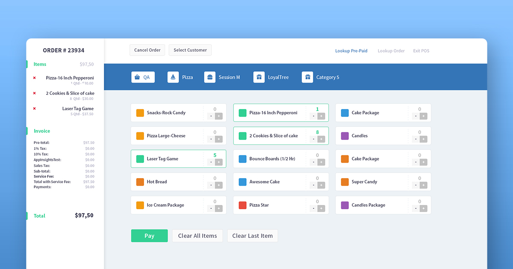

# Point of Sale

This is a **POS** app made on top of VUE.js


## Quickstart

``` sh
yarn
yarn serve
```

## TestRail Integration

Playwright now writes a JUnit report to `test-results/junit-report.xml` and embeds test
annotations as JUnit properties so the TestRail CLI can import richer results.

1. Copy `.env.example` to `.env` and fill in your TestRail host, username, API key, and project name.
2. Install the TestRail CLI with `pip install trcli`.
3. Run `npm run test:e2e:testrail` to execute Playwright and upload the generated JUnit report.

Each test can enrich TestRail results with:

- `testrail_result_comment` annotations for step-by-step context
- `testrail_attachment` annotations for failure screenshots

If you only want to upload an existing JUnit report, run `npm run testrail:upload`.

## User Interface

<p align="center">
  
</p>
